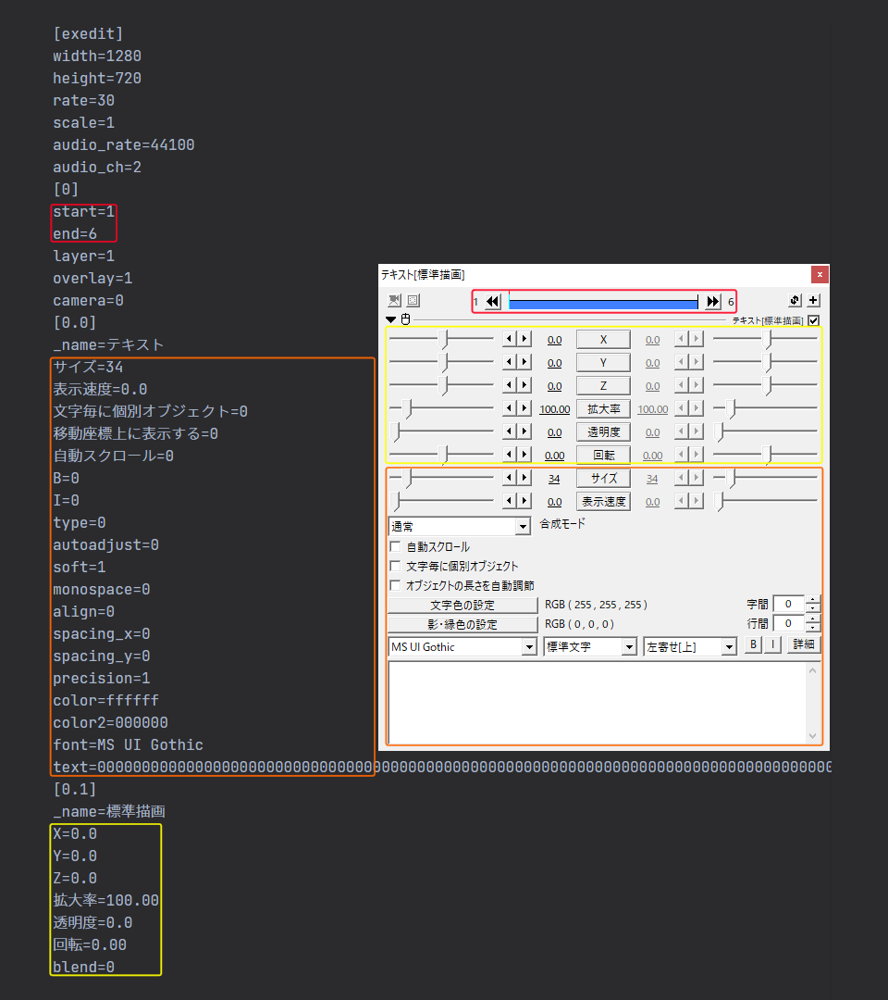

# AviUtlPy

## TL;DR

AviUtlのexoファイルをPythonで読み込んで編集し、編集したexoファイルを出力してAviUtlで読み込むことで、歌詞表示等が一発で完了できるようにスクリプトを組みました。**が、カラオケみたいに高度な表示ではありません！注意！！！**
[プロジェクト](https://github.com/kaganatsu/AviUtlPy)をクローンして、reference.mdを一読の上、ご所望の.pyファイルを実行してください。いろいろ応用が利くスクリプトになっていると思います。
工夫次第で[こんな](https://imgur.com/a/cZSxVbb)動画（歌詞、立ち絵、コード）が簡単に作れます。

## 経緯

初めまして。普段はニコニコ動画に動画投稿をしています。
先日、動画の編集に使用しているAviUtlにexoファイルというものがあることを知りました。中身はINIファイルのためPythonで簡単に編集できるはず。

一応Pythonで編集を試みる理由を掘り下げておきます。
筆者は趣味で[音楽を繋いで一曲にしたもの](https://www.nicovideo.jp/watch/sm42727782)を投稿しているのですが、この形式の音楽はお決まりとして出典を記載する必要があります。多いときは百数曲やそれ以上の音楽の出典の記載を強いられるときもあり、手作業で動画ソフトに打ち込んでいくとなると、面倒くさいしミスも発生します。そこでこの作業をPythonに任せてしまおうというわけです。

曲名が表示できたら歌詞も表示できるよね？じゃあ私以外にも需要あるよね？ということで公開もすることにしました。

## exoをリストと辞書の木構造に変換する

このスクリプトではexoファイルをINI形式からJSONに出力が可能なリストと辞書の木構造に変換しています。そのほうがPythonらしい編集ができそうですから。

以下がexoファイルの中身の一例です。それぞれ同じ色の枠の部分が対応していそうです。



各要素については推測になりますが以下のような感じでしょうか。
- `[exedit]` ➡ 拡張編集の設定。動画のサイズ、fps、音声のサンプリング周波数とチャンネル数などが記載されている。
- `[0]` ➡ オブジェクトのID。startとendがオブジェクトの開始位置と終了位置を表し、layerがレイヤを表す。
- `[0.0]` ➡ `[0]`オブジェクトの固有の設定項目。テキストオブジェクトなのでサイズや表示速度の項目がある。
- `[0.1]` ➡ `[0]`オブジェクトの追加の設定項目。エフェクトをかけていくと`[0.2]`、`[0.3]`...というように増えていく。

以上を踏まえて変換するロジックを組みました。
変換したものをJSONに出力すると以下のようになります。

```json
[
    {
        "exedit": {
            "width": "1280",
            "height": "720",
            "rate": "30",
            "scale": "1",
            "audio_rate": "44100",
            "audio_ch": "2"
        }
    },
    [
        {
            "start": "1",
            "end": "6",
            "layer": "1",
            "overlay": "1",
            "camera": "0"
        },
        [
            {
                "_name": "テキスト",
                "サイズ": "34",
                "表示速度": "0.0",
                "文字毎に個別オブジェクト": "0",
                "移動座標上に表示する": "0",
                "自動スクロール": "0",
                "b": "0",
                "i": "0",
                "type": "0",
                "autoadjust": "0",
                "soft": "1",
                "monospace": "0",
                "align": "0",
                "spacing_x": "0",
                "spacing_y": "0",
                "precision": "1",
                "color": "ffffff",
                "color2": "000000",
                "font": "MS UI Gothic",
                "text": "0000000000000000000000000000000000000000000000000000000000000000000000000000000000000000000000000000000000000000000000000000000000000000000000000000000000000000000000000000000000000000000000000000000000000000000000000000000000000000000000000000000000000000000000000000000000000000000000000000000000000000000000000000000000000000000000000000000000000000000000000000000000000000000000000000000000000000000000000000000000000000000000000000000000000000000000000000000000000000000000000000000000000000000000000000000000000000000000000000000000000000000000000000000000000000000000000000000000000000000000000000000000000000000000000000000000000000000000000000000000000000000000000000000000000000000000000000000000000000000000000000000000000000000000000000000000000000000000000000000000000000000000000000000000000000000000000000000000000000000000000000000000000000000000000000000000000000000000000000000000000000000000000000000000000000000000000000000000000000000000000000000000000000000000000000000000000000000000000000000000000000000000000000000000000000000000000000000000000000000000000000000000000000000000000000000000000000000000000000000000000000000000000000000000000000000000000000000000000000000000000000000000000000000000000000000000000000000000000000000000000000000000000000000000000000000000000000000000000000000000000000000000000000000000000000000000000000000000000000000000000000000000000000000000000000000000000000000000000000000000000000000000000000000000000000000000000000000000000000000000000000000000000000000000000000000000000000000000000000000000000000000000000000000000000000000000000000000000000000000000000000000000000000000000000000000000000000000000000000000000000000000000000000000000000000000000000000000000000000000000000000000000000000000000000000000000000000000000000000000000000000000000000000000000000000000000000000000000000000000000000000000000000000000000000000000000000000000000000000000000000000000000000000000000000000000000000000000000000000000000000000000000000000000000000000000000000000000000000000000000000000000000000000000000000000000000000000000000000000000000000000000000000000000000000000000000000000000000000000000000000000000000000000000000000000000000000000000000000000000000000000000000000000000000000000000000000000000000000000000000000000000000000000000000000000000000000000000000000000000000000000000000000000000000000000000000000000000000000000000000000000000000000000000000000000000000000000000000000000000000000000000000000000000000000000000000000000000000000000000000000000000000000000000000000000000000000000000000000000000000000000000000000000000000000000000000000000000000000000000000000000000000000000000000000000000000000000000000000000000000000000000000000000000000000000000000000000000000000000000000000000000000000000000000000000000000000000000000000000000000000000000000000000000000000000000000000000000000000000000000000000000000000000000000000000000000000000000000000000000000000000000000000000000000000000000000000000000000000000000000000000000000000000000000000000000000000000000000000000000000000000000000000000000000000000000000000000000000000000000000000000000000000000000000000000000000000000000000000000000000000000000000000000000000000000000000000000000000000000000000000000000000000000000000000000000000000000000000000000000000000000000000000000000000000000000000000000000000000000000000000000000000000000000000000000000000000000000000000000000000000000000000000000000000000000000000000000000000000000000000000000000000000000000000000000000000000000000000000000000000000000000000000000000000000000000000000000000000000000000000000000000000000000000000000000000000000000000000000000000000000000000000000000000000000000000000000000000000000000000000000000000000000000000000000000000000000000000000000000000000000000000000000000000000000000000000000000000000000000000000000000000000000000000000000000000000000000000000000000000000000000000000000000000000000000000000000000000000000000000000000000000000000000000000000000000000000000000000000000000000000000000000000000000000000000000000000000000000000000000000000000000000000000"
            },
            {
                "_name": "標準描画",
                "x": "0.0",
                "y": "0.0",
                "z": "0.0",
                "拡大率": "100.00",
                "透明度": "0.0",
                "回転": "0.00",
                "blend": "0"
            }
        ]
    ]
]
```

INI形式のときに数字で表されていたものはリストにしました。
小数点で表されていた設定項目はネストさせています。
